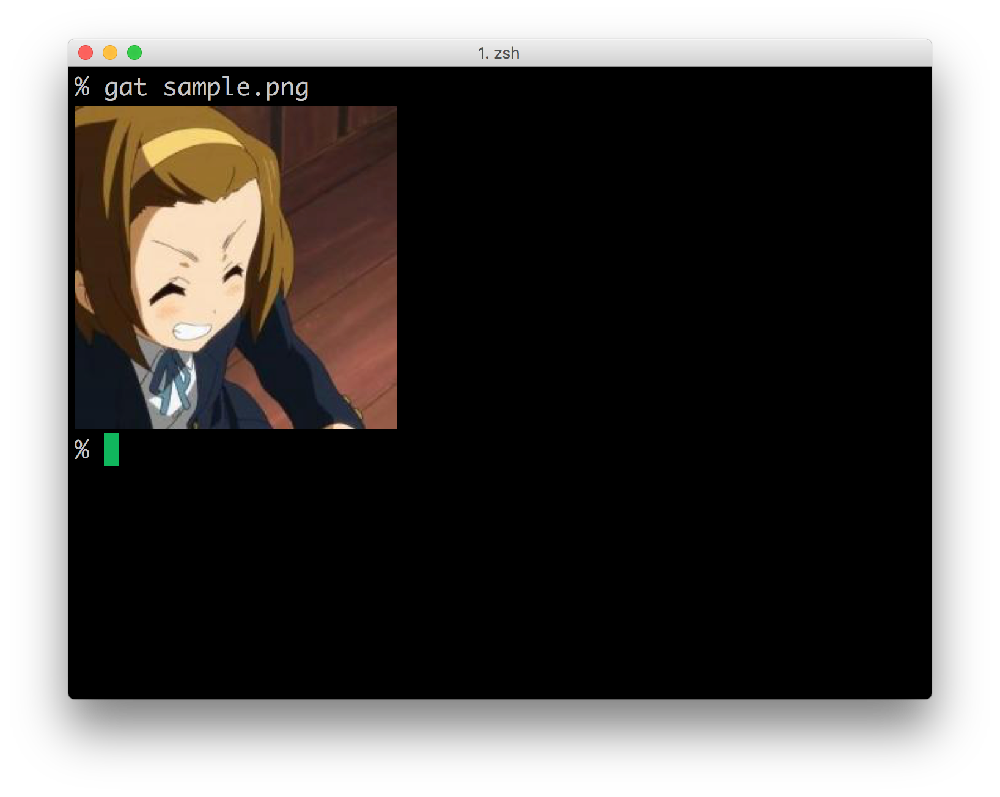
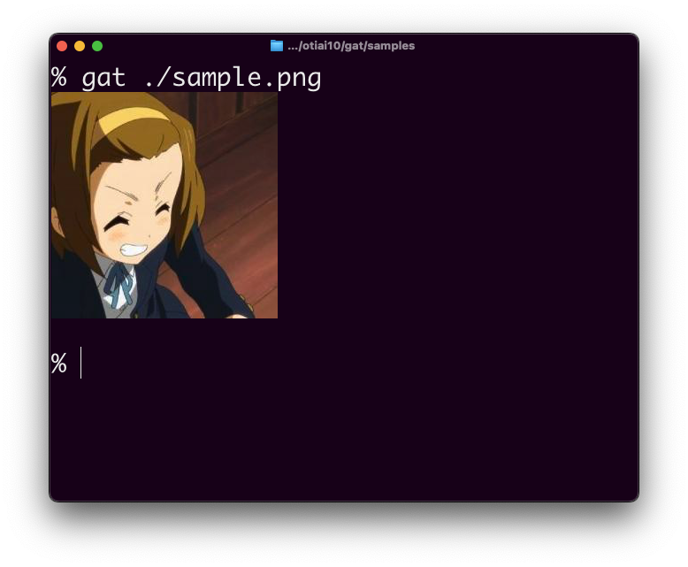
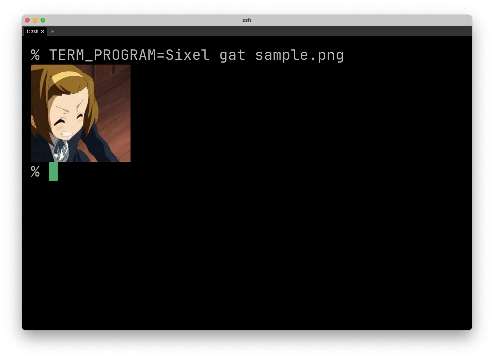
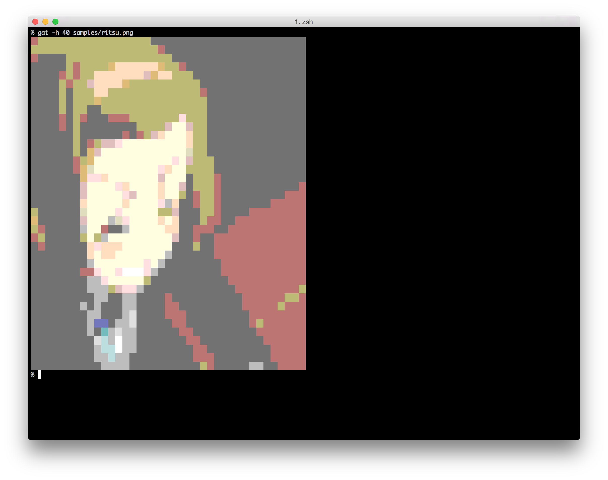

gat
===========

[](https://github.com/otiai10/gat/actions)
[](https://codecov.io/gh/otiai10/gat)

Graphical `cat` command

```sh
# Local file
% gat ./samples/sample.png

# By URL
% gat https://raw.githubusercontent.com/otiai10/gat/master/samples/sample.png
```

| Platform | Terminal App | How it looks |
|:-------:|:------:|:------:|
| iTerm2<br>inline images | iTerm2 |  |
| Kitty | Ghostty |  |
| Sixel | WezTerm<br/>Windows Terminal |  |
| TrueColor | (any terminals) |  |

# Install

```sh
go install github.com/otiai10/gat@latest
```

# Options

```sh
# Interactive deletion mode
gat -i [imagefile]
# then you'll see it and be asked if you wanna delete it.

# iTerm and Sixel
gat -S 0.5 [imagefile] # Scale of output image

# Only for cell grid mode
gat -c [imagefile]      # Use cell grid mode
gat -H 20 [imagefile]   # Rows of output
gat -W 40 [imagefile]   # Cols of output
gat -b [imagefile]      # Print border
gat -t="**" [imagefile] # Text to be printed for each cell
gat -debug [imagefile]  # Dump available colors and color for each cell
```

# As a library

```go
import "github.com/otiai10/gat/render"

r := render.GetDefaultRenderer()
r.Render(os.Stdout, img)
```

See https://godoc.org/github.com/otiai10/gat/render for more information.

# Thanks

- https://github.com/fatih/color/blob/master/color.go
- https://gist.github.com/MicahElliott/719710
- http://hiroki.jp/2012/06/17/4398/
- http://www.m-bsys.com/linux/echo-color-1
- http://qiita.com/mollifier/items/40d57e1da1b325903659
- http://d.hatena.ne.jp/zariganitosh/20150224/escape_sequence
- http://vorfee.hatenablog.jp/entry/2015/03/17/173635
